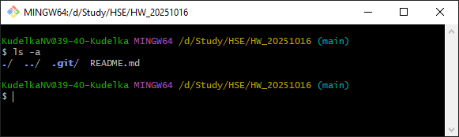
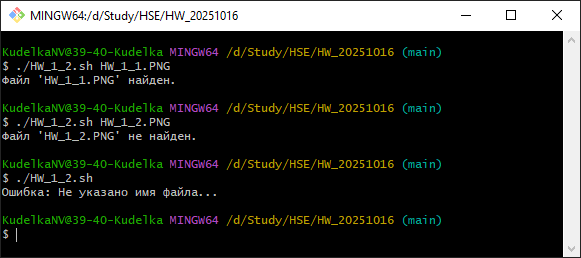
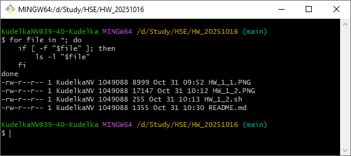
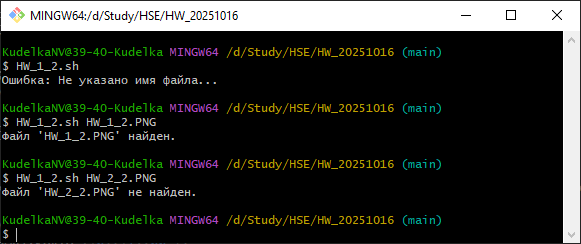
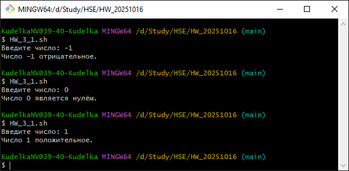
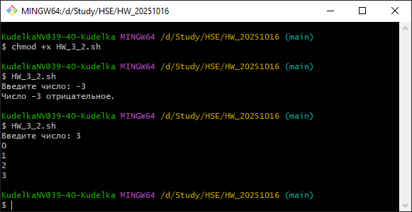
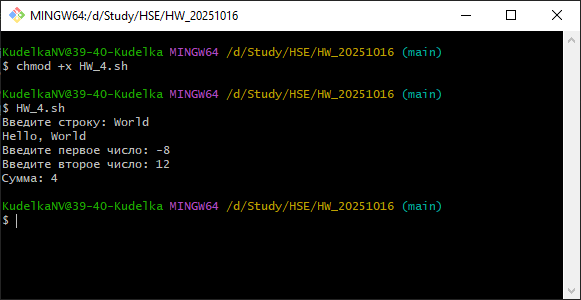

# Домашнее задание с индивидуальной проверкой
##  Задачи
###   1 Функционал Bash

* **Задание:** Напишите Bash-скрипт, который выполняет следующие действия:
    -	Создаёт список всех файлов в текущей директории, указывая их тип (файл, каталог и т.д.).<br />
        
        ```
        ls -a
        ```
        
    -  Проверяет наличие определённого файла, переданного как аргумент скрипта, и выводит сообщение о его наличии или отсутствии.<br />

        ```
        if [ -z "$1" ]; then
            echo "Ошибка: Не указано имя файла..."
            exit 1
        fi
        searchedFile="$1"
        if [ -f "$searchedFile" ]; then 
            echo "Файл '$searchedFile' найден."
        else
            echo "Файл '$searchedFile' не найден."
        fi
        ```
        

    -  Использует цикл for для вывода информации о каждом файле: его имя и права доступа.<br />
        
        ```
        for file in *; do
            if [ -f "$file" ]; then
                ls -l "$file"
            fi
        done
        ```
        
###   2 Переменная PATH
* **Задание:**
    -	Напишите скрипт, который выводит текущее значение переменной PATH и добавляет в неё новую директорию, переданную в качестве аргумента.

        ```
        echo $PATH
        export PATH="$(pwd):$PATH"
        ```
    
    -	Объясните, почему изменения переменной PATH, сделанные через терминал, временные, и предложите способ сделать их постоянными. Добавьте команду в файл .bashrc и продемонстрируйте, как перезапустить терминал для применения изменений.<br />
    <b><i>Применяются только для текущей сессии и процессов запущенных в ней, при закрытии терминала  изменения в переменной обнулятся<br />
    Для постоянного добавления необходимо создать/изменить файл ".bashrc" в домашнем каталоге добавив в него команду из первой части задания "export PATH="$(pwd):$PATH""<br />
    На скриншоте ниже продемонстрировано выполнение скрипта из первого задания без привязки к каталогу</b></i><br />
    
###   3 Управляющие конструкции (условия и циклы)
* **Задание:** Напишите скрипт, который запрашивает у пользователя ввод числа и затем:
    -	Использует if, чтобы проверить, является ли число положительным, отрицательным или нулем, и выводит соответствующее сообщение.

        ```
        read -p "Введите число: " temporyNum
        if (( $temporyNum > 0 )); then
        echo "Число $temporyNum положительное."
        else
            if (( $temporyNum < 0 )); then
                echo "Число $temporyNum отрицательное."
            else
                echo "Число $temporyNum является нулём."
            fi
        fi
        ```
        
    -	Использует while для подсчёта от 1 до введенного числа (если оно положительное).

        ```
        read -p "Введите число: " temporyNum
        if (( $temporyNum < 0 )); then
                echo "Число $temporyNum отрицательное."
        else
            i=0
            while [ $i -le $temporyNum ]; do
            echo $i
            i=$((i + 1))
            done
        fi
        ```
        
###   4 Управляющие конструкции (условия и циклы)
* **Задание:** Создайте скрипт с функцией, которая принимает в качестве аргумента строку и выводит её с префиксом "Hello, ". Напишите ещё одну функцию, которая принимает два числа и возвращает их сумму. Вызовите обе функции в скрипте и продемонстрируйте результат.

        ```
        helloFunction() {
            local input_string="$1"
            echo "Hello, $input_string"
        }

        addFunction() {
            sum=$(( $1 + $2 ))
            echo "Сумма: $sum"
        }

        read -p "Введите строку: " temporyString
        helloFunction $temporyString
        read -p "Введите первое число: " temporyNum1
        read -p "Введите второе число: " temporyNum2
        addFunction $temporyNum1 $temporyNum2
        ```

    


